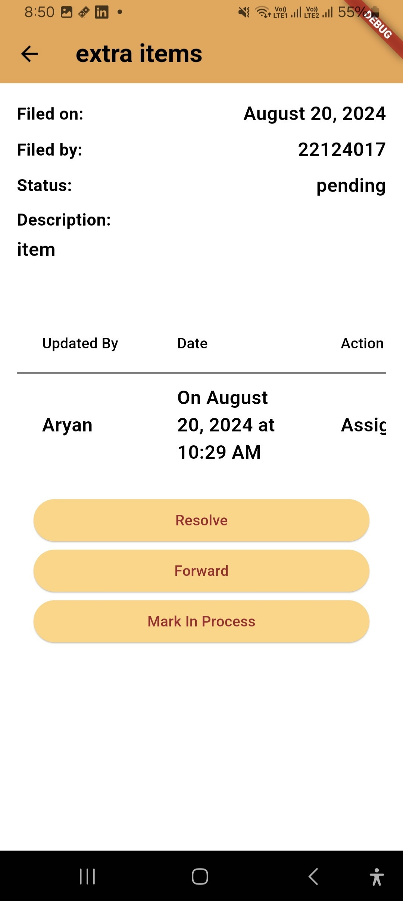

# MessERP 🍽️📲

> *MessERP is a comprehensive hostel mess management system built using **Flutter**, **Dart**, and **Firebase**. The app replaces traditional paper-based workflows with a fully digitized ecosystem, enabling efficient handling of student leave requests, meal tracking, billing, stock updates, and real-time announcements—all from a single platform.*

---

## 🚀 Features

- **Student Leave Management**: Students can easily apply for meal-based or date-based leaves.
- **Leave Approval System**: Admins can view and manage leave requests with automated validations.
- **Stock & Inventory Management**: Track all received and issued items with automated balance calculations.
- **Bill Approval Workflow**: Committee members can approve/reject vendor bills with full item breakdown.
- **QR-Based Meal System**: Scan-based meal tracking using QR codes for students during live meals.
- **Extra Item Requests**: Students can request additional food items with controlled approval.
- **Real-time Announcements**: Notify students with personalized or general announcements instantly.
- **Search & Filter Utilities**: Integrated tools for searching users, tracking meals, and analyzing data.

---

## 🛠️ Tech Stack

| Layer               | Technology                  |
|--------------------|-----------------------------|
| Frontend           | Flutter, Dart               |
| Backend/Database   | Firebase Firestore, Cloud Storage |
| State Management   | Provider                    |
| Analytics/Tools    | Intl (date formatting), QR Flutter, QR Code Scanner |

---

## 📸 Screenshots
<!--  -->

  
  
  
  
  
  
  
  
  
  
  
  
  
  
  
  
  

---

<!-- ## 🏗️ Folder Structure (Simplified) -->

